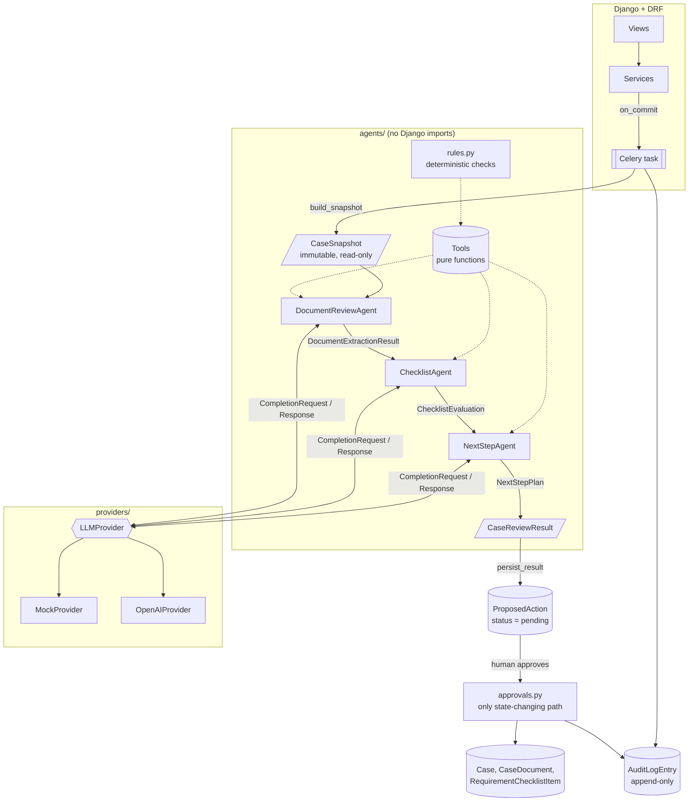

# caseflow-ai

A Django + DRF backend showing one way to put LLM agents into a document-heavy
case workflow without letting them change anything on their own.

Staff open a **case** (think visa or permit application). Each case has a
checklist of required documents. AI agents read the uploaded documents,
extract structured fields, check them against the checklist, and draft next
steps. **Every suggestion is stored as a `ProposedAction` that a human must
approve.** The AI layer has no write access to case state.

> Portfolio project. The domain is generic and every document, name, country,
> and organisation in it is fictional. It runs fully offline with a
> deterministic mock LLM, so no API key is needed.

---

## Contents

- [Architecture](#architecture)
- [Human approval by design](#human-approval-by-design)
- [Structured outputs: Pydantic as the trust boundary](#structured-outputs-pydantic-as-the-trust-boundary)
- [Provider abstraction](#provider-abstraction)
- [Evaluation harness](#evaluation-harness)
- [Quick start (under 5 minutes)](#quick-start-under-5-minutes)
- [API](#api)
- [Design decisions and trade-offs](#design-decisions-and-trade-offs)
- [Project layout](#project-layout)

---

## Architecture



**One review, step by step**

1. `POST /api/cases/{id}/reviews/` creates an `AgentRun` (queued) and enqueues
   a Celery task **after the transaction commits**. A partial unique constraint
   allows only one active run per case.
2. The task claims the run atomically (`queued → running`), so a redelivered
   task does nothing, and builds a frozen `CaseSnapshot`.
3. **DocumentReviewAgent** runs once per pending document. It calls
   `get_document_text` and `get_extraction_schema`, then returns a
   `DocumentExtractionResult`.
4. **ChecklistAgent** gets the *validated* extractions. It calls
   `list_checklist_items` and then `check_requirement_against_checklist` (a
   deterministic rule engine) for each candidate document, and returns a
   `ChecklistEvaluation`.
5. **NextStepAgent** gets the *validated* evaluation and returns a
   `NextStepPlan` of `ProposedActionDraft`s.
6. `persist_result` stores the drafts as pending `ProposedAction`s, marks older
   pending suggestions `superseded`, and saves the full trace on the `AgentRun`.
7. A reviewer approves or rejects each action. `approvals.py` re-checks
   preconditions against the current database state before applying anything.

Each agent is ~40 lines: a prompt, a tuple of tools, an output schema, and
optionally some validation context. The loop lives once in
[`agents/base.py`](agents/base.py).

---

## Human approval by design

In a regulated, document-heavy process, one wrong automated status change can
cost an applicant months. Approval here is part of the architecture, not a UI
convention:

| Guarantee | How it is enforced |
|---|---|
| Agents cannot write | Agents receive an immutable Pydantic `CaseSnapshot`, not ORM objects. Tools are pure functions of that snapshot. There is no DB handle to misuse. |
| Suggestions are inert | The pipeline's only output is `ProposedAction(status=pending)`. [`approvals.py`](cases/services/approvals.py) is the single code path that applies an action's effect. |
| Approvals see current state | Applying an action takes row locks and re-checks preconditions. Examples: you can't mark a requirement satisfied until its document is accepted; you can't mark the case ready while items are open; you can't decide an action twice. A violation returns **409**, never a silent no-op. |
| Stale advice expires | A new review supersedes older pending actions, and approving a superseded action returns 409. |
| Model output never carries data into the DB | For `accept_document`, the extraction stored on approval comes from the validated pipeline result attached by code, not from text the model copied. |
| Everything is attributable | `AuditLogEntry` is append-only (`save()`/`delete()` refuse updates, admin is read-only). It records user and agent actors separately. |

---

## Structured outputs: Pydantic as the trust boundary

All contracts live in [`agents/schemas/`](agents/schemas/):

| Module | Contracts |
|---|---|
| `extraction.py` | `DocumentExtractionResult`, `ExtractedField` |
| `checklist.py` | `ChecklistEvaluation`, `RequirementEvaluation`, `RuleCheckResult` |
| `actions.py` | `NextStepPlan`, `ProposedActionDraft`, `ActionKind` |
| `case.py` | `CaseSnapshot` and the rule types (a discriminated union) |
| `tools.py` | argument and result models for every tool |
| `pipeline.py` | per-step inputs, `AgentTrace`, `CaseReviewResult` |

Validation happens in two layers:

1. **Static shape.** `extra="forbid"` (an invented key is an error), frozen
   models, enums, ISO dates, decimal money, and per-kind target rules (for
   example, `request_document` requires a `message` and must not name a
   document).
2. **Run-specific grounding**, via Pydantic
   [validation context](https://docs.pydantic.dev/latest/concepts/validators/#validation-context).
   The agent passes in facts from *this* run:
   - every `evidence` string must be a **verbatim quote** from the source
     document, and text values must appear in their evidence (the main
     hallucination check);
   - a requirement may be `satisfied` **only if the deterministic rule tool
     returned `passed=true`** for one of its documents during this run. The
     model makes the judgement calls; the tool supplies the facts;
   - a plan may only `accept_document` for documents with a validated
     extraction that satisfies a requirement, and may only propose
     `ready_for_submission` when every requirement is satisfied.

When validation fails, the loop sends the error list back to the model and asks
for a corrected answer. The number of retries is capped. If they run out, the
agent raises `AgentError` with the full trace and **nothing is persisted**. A
document whose extraction keeps failing is treated as `unreviewed`: the
pipeline continues and flags it for a human instead of dropping the whole
review.

```text
provider.complete ─▶ tool_calls? ─yes─▶ validate args ─▶ run tool ─▶ append result ─┐
        ▲                 │ no                                                      │
        │                 ▼                                                         │
        │     output_schema.model_validate_json(raw, context=…)                     │
        │          │ ok ─▶ return AgentResult(output, trace)                        │
        └── retry ◀┘ invalid (≤ 2 retries, then AgentError) ◀───────────────────────┘
```

Tool errors (bad arguments, unknown tool, unknown id) go back to the model as
`{"error": ...}` so it can correct itself. They are not raised.

---

## Provider abstraction

[`agents/providers/base.py`](agents/providers/base.py) defines a small,
vendor-neutral interface:

```python
class LLMProvider(ABC):
    def complete(self, request: CompletionRequest) -> CompletionResponse: ...
```

`CompletionRequest` carries the messages, the tool specs (JSON Schema generated
from the Pydantic args models), and the output JSON Schema. The response has
either `tool_calls` or `content`.

- **`MockProvider`** (default). A deterministic, offline simulator. It follows
  the real protocol: it requests tools, reads their results from the
  conversation, and emits JSON that goes through the same validation. Its
  "understanding" is label regexes and keyword classification, so it **fails
  on prose documents**, and the evals report this. It also has a `script=[...]`
  mode that tests use to inject malformed JSON, invented evidence, bad tool
  calls, and endless tool loops.
- **`OpenAIProvider`**. Chat Completions with function tools and a JSON-schema
  `response_format` (non-strict, because our validators are the real
  guarantee). The SDK handles transient retries.

Choose with `LLM_PROVIDER=mock|openai`. The two layers depend on each other in
one direction only: providers know nothing about case management, and agents
know nothing about vendors. Adding a vendor means writing one adapter file
(~80 lines).

---

## Evaluation harness

```bash
python -m evals.run                      # mock provider, every suite
python -m evals.run --provider openai    # same cases against a real model
python -m evals.run --json eval-report.json --min-pass-rate 0.85   # CI gate
```

Labelled datasets live in [`evals/datasets/`](evals/datasets/). They are
loaded through Pydantic models ([`evals/schemas.py`](evals/schemas.py)) built
on the same contracts as the agents. A fixture that could never be a valid
agent output (unknown field, malformed date, unknown requirement) fails at
load time, not during scoring.

| Suite | Cases | What is measured |
|---|---|---|
| `document_review` | 11 fake documents: clean, alternate date formats, OCR-damaged, prose-only, classification distractor, irrelevant document | type accuracy, **field precision** (did it invent anything?), **field recall** (did it find everything?) |
| `checklist` | 6 cases: all satisfied, expiring passport, missing document, wrong currency and name, unreviewed document, two passports (one expired) | per-requirement status accuracy |
| `next_step` | 4 cases | open-ended plans scored on **must include / must not include** properties (e.g. never propose `ready_for_submission` while funds are insufficient) |

Current mock baseline (`python -m evals.run`, abbreviated):

```text
== document_review  9/11 passed
  FAIL  employment_letter_prose        (all fields missing — no labels to match)
  FAIL  degree_certificate_ceremonial  (all fields missing — no labels to match)
  type_accuracy=1.0  field_precision=1.0  field_recall=0.8
== checklist  6/6 passed      requirement_accuracy=1.0
== next_step  4/4 passed      property_accuracy=1.0
overall: 19/21 cases passed (90%)
```

How to read this:

- The two failures are intentional. The heuristic mock can't read prose, and
  those cases are what a real model is supposed to fix. A test
  ([`tests/test_evals.py`](tests/test_evals.py)) pins this exact failure set,
  so any change in harness or mock behaviour is visible.
- Precision stays at 1.0 even where recall drops. On the damaged scan, the
  correct output **omits** the unreadable expiry date. An invented date would
  count against precision.
- Mock numbers test the **harness and pipeline**, not model quality. The
  numbers that matter come from running the same cases with
  `--provider openai` (or any provider you add) and comparing runs, e.g.
  before and after a prompt change.
- The checklist and next-step suites give the agent pre-validated inputs, so a
  failure points to the step under test rather than an upstream step.

---

## Quick start (under 5 minutes)

Requires Python 3.12+. No API key, Redis, or Docker needed.

```bash
git clone https://github.com/<you>/caseflow-ai.git && cd caseflow-ai
python -m venv .venv && source .venv/bin/activate
pip install -r requirements-dev.txt

python manage.py migrate
python manage.py seed_demo          # user reviewer / demo-password, case #1 with 3 fictional documents
python manage.py runserver
```

In a second terminal:

```bash
A="-u reviewer:demo-password"

# 1. Run the agent review (Celery runs eagerly by default)
curl $A -X POST localhost:8000/api/cases/1/reviews/

# 2. See what the agents propose; nothing has changed yet
curl $A "localhost:8000/api/cases/1/proposed-actions/?status=pending"
#   accept_document            doc 3 (passport)       passed every identity rule
#   mark_requirement_satisfied identity
#   accept_document            doc 2 (offer letter)
#   mark_requirement_satisfied job_offer
#   reject_document            doc 1 (bank statement) closing_balance 8250.00 EUR is below the required 10000 EUR
#   request_document           proof_of_funds         + drafted message to the applicant

# 3. A human decides
curl $A -X POST localhost:8000/api/proposed-actions/1/approve/ \
     -H 'Content-Type: application/json' -d '{"note": "checked against original"}'

# 4. Full trail: who did what, human or agent
curl $A localhost:8000/api/cases/1/audit-log/
```

The browsable API is at `http://localhost:8000/api/` (log in via
`/api-auth/login/`), and the Django admin is at `/admin/` (run
`createsuperuser` first).

```bash
pytest                     # 41 tests, all offline
python -m evals.run        # eval harness
ruff check . && ruff format --check .
```

**Real async execution:** set `CELERY_TASK_ALWAYS_EAGER=false`, start Redis
(`docker run -p 6379:6379 redis`), and run `celery -A config worker -l info`.
The trigger endpoint then returns `202` with a queued run, which you poll at
`GET /api/agent-runs/{id}/`.

**Real model:** `pip install openai`, then `export LLM_PROVIDER=openai
OPENAI_API_KEY=...` (optionally `OPENAI_MODEL`).

---

## API

All endpoints require authentication.

| Method | Path | Purpose |
|---|---|---|
| `GET/POST` | `/api/cases/` | list / create a case (checklist is created from the case-type template) |
| `GET` | `/api/cases/{id}/` | case with checklist and documents |
| `POST` | `/api/cases/{id}/documents/` | upload a `.txt` document (multipart, `file`) |
| `GET/POST` | `/api/cases/{id}/reviews/` | list runs / trigger a review → `202`, or `409` if one is active |
| `GET` | `/api/agent-runs/{id}/` | run status, validated result, per-agent trace (tool calls, validation retries, tokens) |
| `GET` | `/api/cases/{id}/proposed-actions/?status=pending` | suggestions awaiting a decision |
| `POST` | `/api/proposed-actions/{id}/approve/` | apply it (`409` if preconditions no longer hold) |
| `POST` | `/api/proposed-actions/{id}/reject/` | decline it (optional `note`) |
| `GET` | `/api/cases/{id}/audit-log/` | append-only history |

---

## Design decisions and trade-offs

This is a portfolio piece. Where it is simplified, it says so.

**Decisions I'd defend in production**

- **Deterministic rules stay in code.** Date windows, amount thresholds, and
  name matching are exact checks that LLMs get wrong often enough to matter.
  The model decides relevance and wording; `rules.py` decides pass/fail, and
  the schema enforces that split.
- **Per-step validation, not one big prompt.** Each boundary is typed. A
  failure is attributable to one agent and one step, and each step can be
  evaluated on its own.
- **Framework-agnostic agent package.** `agents/` never imports Django, so the
  evals run without a database and the layer could move to another service
  unchanged.
- **Fail closed.** If the checklist or planning step can't produce valid
  output, the run fails with a trace and proposes nothing. A partial plan is
  worse than no plan.
- **Persist traces.** Every run stores its tool calls, validation errors,
  retries, and token counts. When a reviewer asks "why did it suggest this?",
  the answer is in the database.

**Simplified on purpose**

- **Text documents only.** Uploads must be UTF-8 `.txt`. Real intake needs OCR
  and layout extraction (PDFs, scans), which is a separate problem.
- **The mock is heuristic, not intelligent.** It exists to exercise the
  protocol and run CI offline. It is not a baseline for model quality.
- **No tenancy or roles.** Any authenticated user can see and decide any case.
  A real system needs organisation scoping on every queryset and separate
  permissions for approval.
- **Approving `request_document` doesn't send anything.** Delivery would be an
  outbox row written in the same transaction and sent by a worker.
- **Evidence grounding is substring-based.** It catches invented quotes, not a
  real quote attached to the wrong field. Dates and money are checked for
  format, not re-derived from the evidence.
- **No currency conversion.** A USD statement fails a EUR threshold on purpose.
- **Reviews are whole-case.** Every review re-evaluates the full checklist and
  supersedes earlier suggestions. That is simple and correct, but costs more
  tokens than incremental review.
- **Small eval set.** 21 hand-written cases show the method. They say nothing
  statistical about a model. A real setup would use hundreds of labelled
  (anonymised) documents and track results across prompt and model versions.
- **SQLite and eager Celery by default** for the 5-minute setup. The code uses
  `select_for_update`, `on_commit`, and a partial unique constraint, which
  behave correctly on Postgres. SQLite serialises writes anyway.

---

## Project layout

```text
agents/                     framework-agnostic agent layer
  schemas/                  ← every Pydantic contract (start here)
  providers/                LLMProvider interface, mock, OpenAI adapter
  base.py                   the agent loop: tools → validated output → bounded retry
  document_review.py        DocumentReviewAgent
  checklist.py              ChecklistAgent
  next_step.py              NextStepAgent
  pipeline.py               extract → evaluate → plan
  tools.py                  pure, read-only tools
  rules.py                  deterministic requirement checks
cases/                      Django app
  models.py                 Case, CaseDocument, RequirementChecklistItem,
                            AgentRun, ProposedAction, AuditLogEntry
  services/review.py        snapshot in, suggestions out
  services/approvals.py     the only path that changes state from a suggestion
  checklists.py             checklist templates (typed with the agent rule models)
  tasks.py, views.py, serializers.py
evals/                      datasets, fixture schemas, runner + scoring
tests/                      schema, rule, agent-loop, pipeline, API, eval tests
sample_documents/           fictional documents used by seed_demo
```

## License

MIT
